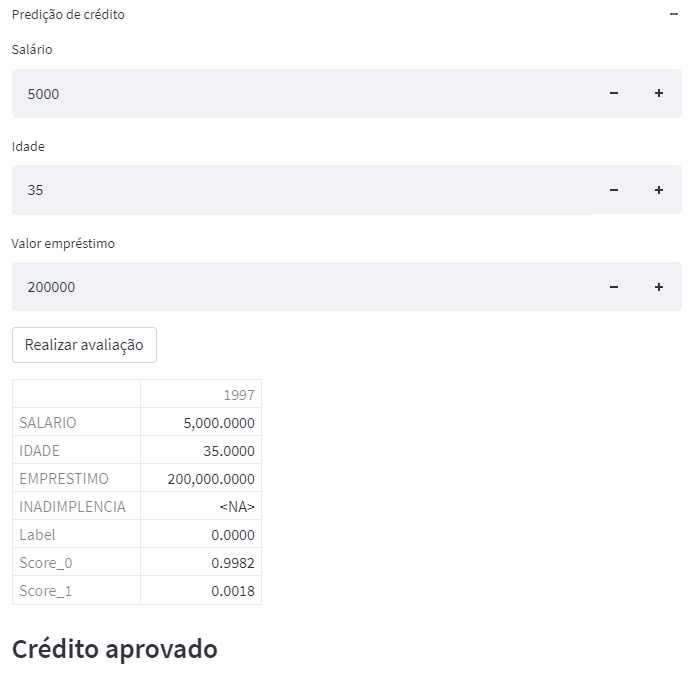
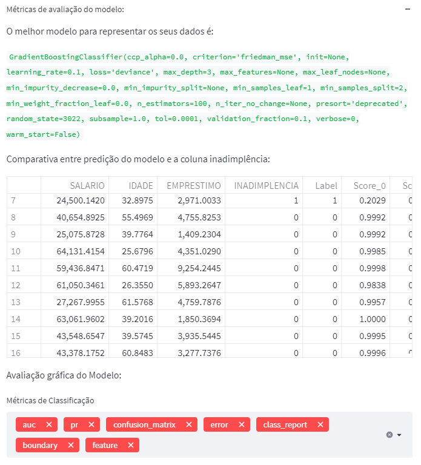

# FastApproval

FastApproval é um aplicativo na nuvem utilizando a biblioteca [Streamlit](https://streamlit.io/) (Python) para rodar um modelo de classificação de crédito usando a biblioteca [PyCaret](https://pycaret.org/). 

## Para acessá-lo [Clique aqui](https://share.streamlit.io/guihungaro/fastapproval/main). 

----

## 01. Sobre o projeto.

Para fazer a classificação de crédito temos uma base de dados de crédito onde a biblioteca *PyCaret* ira rodar diversos algoritmos de classificação e ver qual perfoma melhor.  

A ideia é que o usuário possa colocar os dados de salário, idade e qual o valor do empréstimo e tenha a resposta se o crédito foi aprovado ou não.

Caso queira analisar como está o desempenho do modelo deixei separado uma parte de *Métricas de avaliação do modelo*.

----

## OBSERVAÇÃO:

* Este projeto é apenas uma brincadeira para integrar a biblioteca PyCaret com o Streamlit e rodar um aplicativo de classificação de crédito. O aplicativo em si não possuí nenhuma aplicação comercial na forma como esta. 

* O aplicativo está um pouco pesado e as vezes demora para carregar.

* A base de dados que eu utilizei não está muito legal, estou procurando uma melhor para deixar a predição mais otimizada. 
